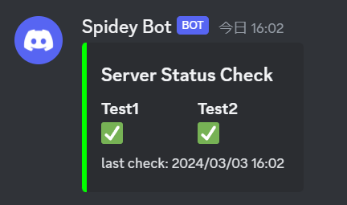

# Port Status Check Bot(Discord)
ポート監視(TCP/UDP)の結果をDiscordに投稿するBot(Webhook)

## イメージ


## Dockerコンテナで実行する
1. DiscordのWebhookを取得する。

> [!NOTE]
> 本BOTはデフォルトで結果を連投します。1つのメッセージを永遠に更新し続けたい場合はメッセージIDを取得する必要があります。

2. `git clone https://github.com/ryo-icy/port-status-check-bot.git`

3. `config.yaml`を準備
    ```
    portcheck:
    - name: <Name>
        host: <IP or FQDN>
        port: <Port>
        protocol: <TCP or UDP>
    ```
    ### 例
    ```
    portcheck:
    - name: Test1
        host: 192.168.1.222
        port: 30100
        protocol: TCP
    - name: Test2
        host: 192.168.1.222
        port: 30100
        protocol: UDP
    
    bottitle: <Bot Title>
    ```

4. `docker-compose.yaml`の項目を自分の環境に合わせる。
    ```
    environment:
      SCB_WEBHOOK: ${WEBHOOK}
      SCB_MESSAGE_ID: ${MESSAGE_ID}
      SCB_INTERVAL: 30
    volumes:
      - ./app/script/config.yaml:/script/config.yaml:ro
    ```

    ### パラメータ
    | パラメータ | 必須 | 説明 |
    | --- | --- | --- |
    | SCB_WEBHOOK | True | DiscordのWebhookURLを指定 |
    | SCB_MESSAGE_ID | False | メッセージを連投ではなく、1つのメッセージを更新し続ける際に指定<br>指定するIDは使用するWebhookが投稿したものでなければならない |
    | SCB_INTERVAL | True | ステータスをチェックするインターバルを指定<br>1以上の整数 |

5. `docker compose up -d`


## Pythoで実行する
1. DiscordのWebhookを取得する。

2. `git clone https://github.com/ryo-icy/port-status-check-bot.git`

3. `cd ./app/script`

4. `config.yaml`を準備
    ```
    portcheck:
    - name: <Name>
        host: <IP or FQDN>
        port: <Port>
        protocol: <TCP or UDP>
    
    bottitle: <Bot Title>
    ```

5. `local_setting.py`を作成
    ```
    SCB_MESSAGE_ID = ""
    SCB_WEBHOOK = ""
    SCB_INTERVAL = 30
    ```

> [!NOTE]
> 環境変数でも可能

6. `pipenv install -r requirements.txt`

7. `pipenv run python3 ./discordbot.py`
